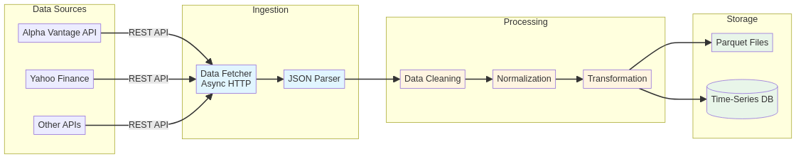

# 🔄 Rust Market Data Pipeline


<div align="center">
  
</div>

<div align="center">
  <h3>⚡ High-performance data pipeline for financial market data</h3>
  <p>Ingest, process, and store market data with blazing speed and reliability</p>
</div>

---

## 🇧🇷 Descrição em Português

`rust-market-data-pipeline` é um sistema robusto e escalável para **ingestão**, **processamento** e **armazenamento** de dados do mercado financeiro. Construído em Rust com Tokio para operações assíncronas, oferece **baixa latência**, **alta throughput** e **confiabilidade** para aplicações financeiras críticas.

### ✨ Funcionalidades Principais

- 🔌 **Conectores de Dados** - Integração com APIs de mercado (Alpha Vantage, etc.)
- 🔄 **Processamento Assíncrono** - Pipeline não-bloqueante com Tokio
- 💾 **Armazenamento Eficiente** - Formato colunar Apache Parquet
- 🧹 **Limpeza de Dados** - Normalização e transformação automática
- 🏗️ **Arquitetura Modular** - Crates independentes e reutilizáveis

---

## 🇺🇸 English Description

`rust-market-data-pipeline` is a robust and scalable system for **ingesting**, **processing**, and **storing** financial market data. Built in Rust with Tokio for asynchronous operations, it offers **low latency**, **high throughput**, and **reliability** for critical financial applications.

### ✨ Key Features

- 🔌 **Data Connectors** - Integration with market APIs (Alpha Vantage, etc.)
- 🔄 **Asynchronous Processing** - Non-blocking pipeline with Tokio
- 💾 **Efficient Storage** - Apache Parquet columnar format
- 🧹 **Data Cleaning** - Automatic normalization and transformation
- 🏗️ **Modular Architecture** - Independent and reusable crates

---

## 🚀 Quick Start

### Prerequisites

- [Rust](https://www.rust-lang.org/tools/install) 1.70+
- Git
- [Alpha Vantage API Key](https://www.alphavantage.co/support/#api-key) (free)

### Installation

```bash
# Clone the repository
git clone https://github.com/galafis/rust-market-data-pipeline.git
cd rust-market-data-pipeline

# Run the example
cargo run --example data_pipeline
```

### Example Output

```
Dados brutos recebidos:
shape: (100, 6)
┌────────────┬────────┬────────┬─────────┬────────┬─────────┐
│ date       ┆ open   ┆ high   ┆ low     ┆ close  ┆ volume  │
│ ---        ┆ ---    ┆ ---    ┆ ---     ┆ ---    ┆ ---     │
│ str        ┆ f64    ┆ f64    ┆ f64     ┆ f64    ┆ i64     │
╞════════════╪════════╪════════╪═════════╪════════╪═════════╡
│ 2025-10-02 ┆ 285.79 ┆ 288.54 ┆ 282.79  ┆ 286.72 ┆ 3814232 │
│ 2025-07-03 ┆ 287.94 ┆ 292.32 ┆ 287.9   ┆ 291.97 ┆ 1853289 │
│ ...        ┆ ...    ┆ ...    ┆ ...     ┆ ...    ┆ ...     │
└────────────┴────────┴────────┴─────────┴────────┴─────────┘
Dados processados e armazenados em output/ibm_daily.parquet
```

---

## 📚 Usage Example

### Building a Custom Data Pipeline

```rust
use rmdp_data::fetch_market_data;
use rmdp_core::process_data;
use polars::prelude::*;

#[tokio::main]
async fn main() -> Result<()> {
    // Fetch data from API
    let raw_data = fetch_market_data(
        "IBM",
        "TIME_SERIES_DAILY",
        "YOUR_API_KEY"
    ).await?;

    // Process and clean data
    let processed_data = process_data(&raw_data)?;

    // Store in Parquet format
    ParquetWriter::new(File::create("output/data.parquet")?)
        .finish(&mut processed_data)?;

    println!("Pipeline completed successfully!");
    Ok(())
}
```

---

## 🏗️ Architecture

The pipeline follows a modular ETL (Extract, Transform, Load) architecture:

<div align="center">
  
</div>

### ETL Process

```
┌─────────────┐      ┌──────────────┐      ┌─────────────┐
│   Extract   │ ───> │  Transform   │ ───> │    Load     │
│  (Ingest)   │      │  (Process)   │      │  (Storage)  │
└─────────────┘      └──────────────┘      └─────────────┘
      │                     │                      │
   API Data          Clean & Normalize        Parquet
```

### Project Structure

```
rust-market-data-pipeline/
├── crates/
│   ├── core/          # Pipeline orchestration & processing
│   ├── data/          # Data connectors & API integrations
│   └── utils/         # Logging & utilities
├── examples/          # Usage examples
├── output/           # Processed data storage
└── docs/             # Documentation & images
```

### Crate Descriptions

| Crate | Description |
|-------|-------------|
| **rmdp-core** | Pipeline orchestration and data processing logic |
| **rmdp-data** | API connectors for external data sources |
| **rmdp-utils** | Logging and utility functions |

---

## 📊 Supported Data Sources

- ✅ **Alpha Vantage** - Stock market data
- 🔜 **Yahoo Finance** - Historical and real-time quotes
- 🔜 **CoinGecko** - Cryptocurrency data
- 🔜 **Binance** - Crypto exchange data
- 🔜 **IEX Cloud** - Financial data API

---

## 🛣️ Roadmap

- [ ] Add support for more data sources (Yahoo Finance, CoinGecko)
- [ ] Implement real-time streaming with WebSockets
- [ ] Add Redis caching layer for API responses
- [ ] Integration with time-series databases (InfluxDB, TimescaleDB)
- [ ] Create monitoring dashboard for pipeline health
- [ ] Add data quality validation and alerts
- [ ] Implement retry logic and error handling
- [ ] Support for multiple output formats (CSV, JSON, Parquet)

---

## 🤝 Contributing

Contributions are welcome! Please feel free to submit a Pull Request.

1. Fork the repository
2. Create your feature branch (`git checkout -b feature/DataSource`)
3. Commit your changes (`git commit -m 'Add new data source'`)
4. Push to the branch (`git push origin feature/DataSource`)
5. Open a Pull Request

---

## 📜 License

This project is licensed under the MIT License - see the [LICENSE](LICENSE) file for details.

---

## 👨‍💻 Author

**Gabriel Demetrios Lafis**

- 🎓 Systems Analysis and Development | IT Management | Cybersecurity
- 💼 Data Scientist | Data Analyst | BI/BA
- 🔗 [GitHub](https://github.com/galafis)

---

## 🙏 Acknowledgments

- Built with [Rust](https://www.rust-lang.org/)
- Async runtime: [Tokio](https://tokio.rs/)
- Data processing: [Polars](https://www.pola.rs/)
- Storage format: [Apache Parquet](https://parquet.apache.org/)

---

<div align="center">
  <p>Made with ❤️ and Rust</p>
  <p>⭐ Star this repository if you find it useful!</p>
</div>
